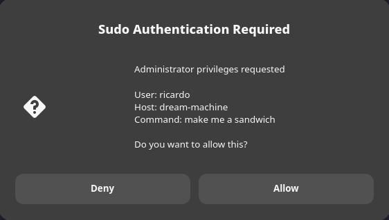

# sudoplz

Give Claude Code, Cursor, and other AI coding agents the ability to run `sudo` — with a real GUI password prompt every time, no passwordless sudo, no `/etc/sudoers` allowlists.

`sudoplz` plugs into `sudo -A`. When the agent runs `sudo -A <command>`, a dialog pops up showing the exact command about to run, with a field to type your sudo password. Sudo validates it the normal way — `sudoplz` never stores your password or decides whether it's correct.



## Why

Coding agents can't handle interactive terminal prompts. Ask Claude Code to run `sudo apt install foo` and you get `sudo: Authentication failed`. The common workarounds all have problems:

- **Passwordless sudo** gives the agent — and anything else running as your user — unrestricted root.
- **`/etc/sudoers` allowlists** require predicting every command the agent will ever need. No case-by-case review.
- **Manual copy-paste** is tedious and breaks the agent's flow.

`sudoplz` solves this by giving `sudo -A` a real GUI equivalent of the terminal password prompt: you see the exact command, you type your password, sudo checks it. No password is ever stored on disk.

This threat model assumes a personal workstation with an encrypted disk. Not appropriate for shared or production systems.

## Installation

1. **If you're on `sudo-rs`, make sure it's version 0.2.11 or newer.** Earlier `sudo-rs` releases don't support the `-A`/`--askpass` flag. Check with `sudo --version`. On a slow-to-release distro (e.g. Debian) with an older packaged `sudo-rs`, switch to traditional `sudo`:
   ```bash
   sudo update-alternatives --install /usr/bin/sudo sudo /usr/bin/sudo.ws 100
   sudo update-alternatives --config sudo   # pick sudo.ws
   ```
2. Install `zenity` on Linux — it provides the GUI password dialog. Pre-installed on most GNOME-based distros; `sudo apt install zenity` if missing. Not needed on macOS (uses AppleScript).
3. Install from PyPI with [`uv`](https://docs.astral.sh/uv/):
   ```bash
   uv tool install sudoplz
   ```
   This puts `askpass` and `sudoplz` on your PATH. (For development: clone the repo and run `uv tool install .` instead.)
4. Point `SUDO_ASKPASS` at the installed binary (add to `~/.bashrc`, `~/.zshrc`, etc.):
   ```bash
   export SUDO_ASKPASS="$(which askpass)"
   ```

## Usage

Your agent (or you) runs `sudo -A <command>`. A dialog pops up showing the command and asking for your sudo password. Type it (or cancel to deny).

```bash
sudo -A apt install foo
```

Gotcha: `sudo -n` explicitly disallows prompting and will never trigger askpass. Always use `-A`.

Test the integration with:

```bash
sudoplz test
```

## Security

`sudoplz` never stores, sees, or validates your password — it just relays what you type to `sudo`, which checks it the normal way (PAM/`/etc/shadow`). There's nothing on disk to steal.

The askpass script still runs these checks on every invocation before it even shows the dialog; any failure means no prompt:

- **Caller path whitelist.** Only prompts when the caller's working directory is on an allowlist (home, `/tmp`, etc.). Blocks invocations from unexpected locations like `/var/tmp/malicious`.
- **Caller process whitelist.** Parent process must be on an allowlist (sudo, your shell, your IDE, your deploy tool). Keeps arbitrary binaries from invoking askpass directly.
- **Rate limiting.** Configurable max-attempts-per-hour and lockout window. Contains runaway scripts and brute-force attempts.

Configure these in `~/.config/sudoplz/config.json` — an example is shipped as `askpass-config.json` in the repo; copy it and edit.

### Headless/SSH usage

If there's no `DISPLAY` (e.g. an SSH session without X forwarding) and not macOS, askpass falls back to prompting for the password on `/dev/tty` instead of a GUI dialog.

## Commands

```bash
sudoplz test    # Test sudo integration
sudoplz audit   # Show recent askpass usage
sudoplz config  # View or modify rate-limit settings
```

## Credits

The idea — gating `sudo -A` behind a GUI prompt so coding agents can trigger sudo without a blind passwordless grant — traces back to [GlassOnTin/secure-askpass](https://github.com/GlassOnTin/secure-askpass), which used SSH-key-encrypted password storage plus a click-to-approve dialog. `sudoplz` started as a fork of that approach and now instead prompts for your real password on every invocation, so there's no stored secret and no approval step weaker than a password. Thanks to [@GlassOnTin](https://github.com/GlassOnTin) for the original idea.

## License

MIT — see LICENSE.
